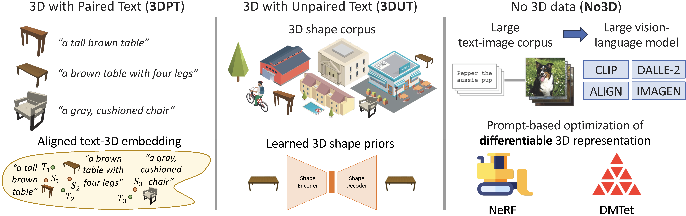
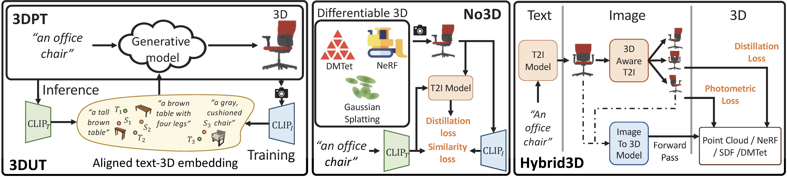
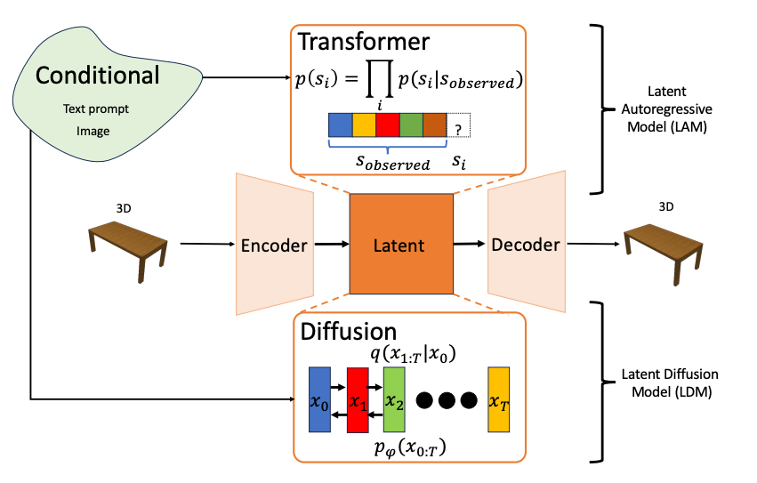
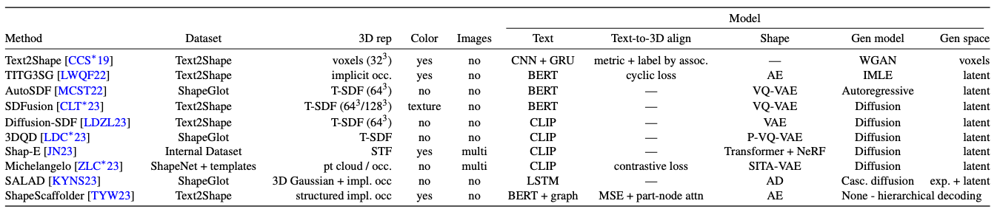
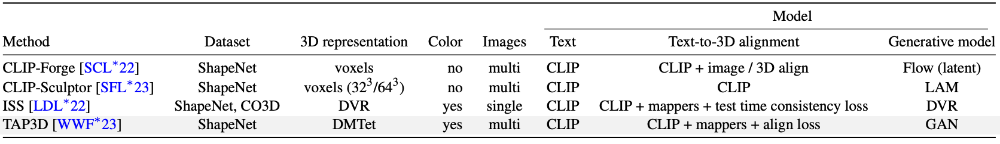
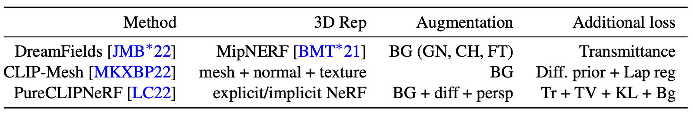
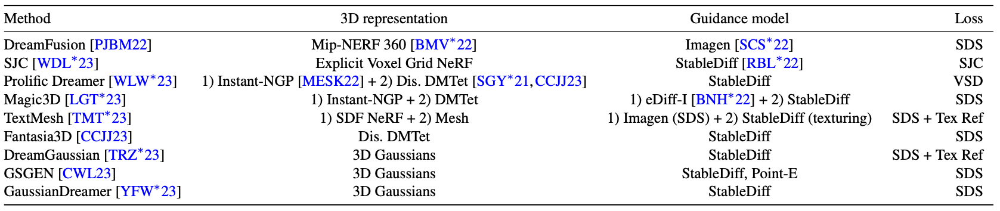
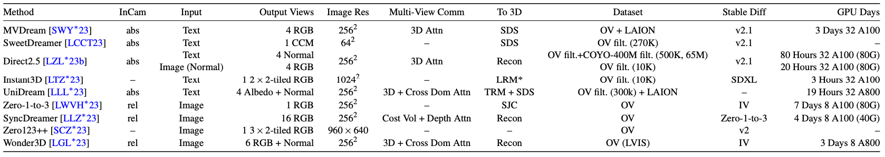

# Text-to-3D Shape Generation Paper List

**Eurographics STAR 2024**

[Han-Hung Lee1](https://hanhung.github.io/), 
[Manolis Savva1](https://msavva.github.io/) and 
[Angel Xuan Chang1,2](https://angelxuanchang.github.io/)

1 Simon Fraser University 2 Canada-CIFAR AI Chair, Amii

## Abstract
> Recent years have seen an explosion of work and interest in text-to-3D shape generation. Much of the progress is driven by
> advances in 3D representations, large-scale pretraining and representation learning for text and image data enabling generative
> AI models, and differentiable rendering. Computational systems that can perform text-to-3D shape generation have captivated
> the popular imagination as they enable non-expert users to easily create 3D content directly from text. However, there are
> still many limitations and challenges remaining in this problem space. In this state-of-the-art report, we provide a survey of
> the underlying technology and methods enabling text-to-3D shape generation to summarize the background literature. We then
> derive a systematic categorization of recent work on text-to-3D shape generation based on the type of supervision data required.
> Finally, we discuss limitations of the existing categories of methods, and delineate promising directions for future work.

## Datasets

### 3D
- [ShapeNet: An Information-Rich 3D Model Repository](https://arxiv.org/abs/1512.03012),\
Chang et al., Arxiv 2015\
[Website](https://shapenet.org/)
- [ABO: Dataset and Benchmarks for Real-World 3D Object Understanding](https://arxiv.org/abs/2110.06199),\
Collins et al., CVPR 2022\
[Website](https://amazon-berkeley-objects.s3.amazonaws.com/index.html)
- [Objaverse: A Universe of Annotated 3D Objects](https://arxiv.org/abs/2212.08051),\
Deitke et al., CVPR 2023\
[Website](https://objaverse.allenai.org/)
- [Objaverse-XL: A Universe of 10M+ 3D Objects](https://arxiv.org/abs/2307.05663),\
Deitke et al., NeurIPS 2023\
[Website](https://objaverse.allenai.org/)

### Text-3D
- [Text2Shape: Generating Shapes from Natural Language by Learning Joint Embeddings](https://arxiv.org/abs/1803.08495),\
Chen et al., Arxiv 2018\

- [ShapeGlot: Learning Language for Shape Differentiation](https://arxiv.org/abs/1905.02925),\
Achlioptas et al., ICCV 2019\

- [ShapeTalk: A Language Dataset and Framework for 3D Shape Edits and Deformations](https://openaccess.thecvf.com/content/CVPR2023/papers/Achlioptas_ShapeTalk_A_Language_Dataset_and_Framework_for_3D_Shape_Edits_CVPR_2023_paper.pdf),\
Achlioptas et al., CVPR 2023\

- [OpenShape: Scaling Up 3D Shape Representation Towards Open-World Understanding](https://arxiv.org/abs/2305.10764),\
Liu et al.,NeurIPS 2023\

- [Scalable 3D Captioning with Pretrained Models](https://arxiv.org/abs/2306.07279),\
Luo et al., NeurIPS 2023\

## Paired Text to 3D (3DPT)

- [Text2Shape: Generating Shapes from Natural Language by Learning Joint Embeddings](https://arxiv.org/abs/1803.08495),\
Chen et al., Arxiv 2018\

- [Towards Implicit Text-Guided 3D Shape Generation](https://arxiv.org/abs/2203.14622),\
Liu et al., CVPR 2022\

### Autoregressive Prior

- [AutoSDF: Shape Priors for 3D Completion, Reconstruction and Generation](https://arxiv.org/abs/2203.09516),\
Mittal et al., CVPR 2022\

- [ShapeCrafter: A Recursive Text-Conditioned 3D Shape Generation Model](https://arxiv.org/abs/2207.09446),\
Fu et al., NeurIPS 2022\

### Diffusion Prior

- [SDFusion: Multimodal 3D Shape Completion, Reconstruction, and Generation](https://arxiv.org/abs/2212.04493),\
Cheng et al., CVPR 2023\

- [Diffusion-SDF: Text-to-Shape via Voxelized Diffusion](https://arxiv.org/abs/2212.03293)\
Li et al., CVPR 2023,\

- [3DQD: Generalized Deep 3D Shape Prior via Part-Discretized Diffusion Process](https://arxiv.org/abs/2303.10406),\
Li et al., CVPR 2023\

- [Shap-E: Generating Conditional 3D Implicit Functions](https://arxiv.org/abs/2305.02463),\
Jun et al., Arxiv 2023\

- [Michelangelo: Conditional 3D Shape Generation based on Shape-Image-Text Aligned Latent Representation](https://arxiv.org/abs/2306.17115),\
Zhao et al., NeurIPS 2023\

### Structure Aware
- [ShapeScaffolder: Structure-Aware 3D Shape Generation from Text](https://www.yongliangyang.net/docs/shapescaffolder_iccv23.pdf),\
Tian et al., ICCV 2023
- [SALAD: Part-Level Latent Diffusion for 3D Shape Generation and Manipulation](https://arxiv.org/abs/2303.12236),\
Koo et al., ICCV 2023\

- [Neural Shape Compiler: A Unified Framework for Transforming between Text, Point Cloud, and Program](https://arxiv.org/abs/2212.12952),\
Luo et al., Arxiv 2022\

## Unpaired 3D Data (3DUT)
- [CLIP-Forge: Towards Zero-Shot Text-to-Shape Generation](https://arxiv.org/abs/2110.02624),\
Sanghi et al., CVPR 2022\

- [CLIP-Sculptor: Zero-Shot Generation of High-Fidelity and Diverse Shapes from Natural Language](https://arxiv.org/abs/2211.01427),\
Sanghi et al., CVPR 2023
- [ISS: Image as Stepping Stone for Text-Guided 3D Shape Generation](https://arxiv.org/abs/2209.04145),\
Liu et al., ICLR 2023\

- [TAPS3D: Text-Guided 3D Textured Shape Generation from Pseudo Supervision](https://arxiv.org/abs/2303.13273),\
Wei et al., CVPR 2023\

## Text-to-3D without 3D data (NO3D)

### Unsupervised CLIP Guidance
- [Zero-Shot Text-Guided Object Generation with Dream Fields](https://arxiv.org/abs/2112.01455),\
Jain et al., CVPR 2022\

- [CLIP-Mesh: Generating textured meshes from text using pretrained image-text models](https://arxiv.org/abs/2203.13333),\
Khalid et al., SIGGRAPH Asia 2022\

- [Understanding Pure CLIP Guidance for Voxel Grid NeRF Models](https://arxiv.org/abs/2209.15172),\
Lee et al., Arxiv 2022\

- [Dream3D: Zero-Shot Text-to-3D Synthesis Using 3D Shape Prior and Text-to-Image Diffusion Models](https://arxiv.org/abs/2212.14704),\
Xu et al., CVPR 2023\

### Unsupervised Diffusion Guidance

#### Loss Formulation
- [DreamFusion: Text-to-3D using 2D Diffusion](https://arxiv.org/abs/2209.14988),\
Poole et al., ICLR 2023
- [Score Jacobian Chaining: Lifting Pretrained 2D Diffusion Models for 3D Generation](https://arxiv.org/abs/2212.00774),\
Wang et al., CVPR 2023\

- [ProlificDreamer: High-Fidelity and Diverse Text-to-3D Generation with Variational Score Distillation](https://arxiv.org/abs/2305.16213),\
Wang et al., NeurIPS 2023\

#### 3D Representation Improvements
- [Magic3D: High-Resolution Text-to-3D Content Creation](https://arxiv.org/abs/2211.10440),\
Lin et al., CVPR 2023
- [TextMesh: Generation of Realistic 3D Meshes From Text Prompts](https://arxiv.org/abs/2304.12439),\
Tsalicoglou et al., 3DV 2024
- [Fantasia3D: Disentangling Geometry and Appearance for High-quality Text-to-3D Content Creation](https://arxiv.org/abs/2303.13873),\
Chen et al., ICCV 2023\

- [DreamGaussian: Generative Gaussian Splatting for Efficient 3D Content Creation](https://arxiv.org/abs/2309.16653),\
Tang et al., ICLR 2024\

- [Text-to-3D using Gaussian Splatting](https://arxiv.org/abs/2309.16585),\
Chen et al., CVPR 2024\

- [GaussianDreamer: Fast Generation from Text to 3D Gaussians by Bridging 2D and 3D Diffusion Models](https://arxiv.org/abs/2310.08529),\
Yi et al., CVPR 2024\

#### Janus Problem Mitigation
- [Debiasing Scores and Prompts of 2D Diffusion for View-consistent Text-to-3D Generation](https://arxiv.org/abs/2303.15413),\
Hong et al., NeurIPS 2023\

- [Let 2D Diffusion Model Know 3D-Consistency for Robust Text-to-3D Generation](https://arxiv.org/abs/2303.07937),\
Seo et al., ICLR 2024\

- [Re-imagine the Negative Prompt Algorithm: Transform 2D Diffusion into 3D, alleviate Janus problem and Beyond](https://arxiv.org/abs/2304.04968),\
Armandpour et al., Arxiv 2023\

#### Generative Modeling
- [ATT3D: Amortized Text-to-3D Object Synthesis](https://arxiv.org/abs/2306.07349),\
Lorraine et al., ICCV 2023
- [Instant3D: Instant Text-to-3D Generation](https://arxiv.org/abs/2311.08403),\
Li et al., Arxiv 2023\

#### Further Reading
- [LucidDreamer: Towards High-Fidelity Text-to-3D Generation via Interval Score Matching](https://arxiv.org/abs/2311.11284),\
Liang et al., CVPR 2024\

- [Noise-Free Score Distillation](https://arxiv.org/abs/2310.17590),\
Katzir et al., Arxiv 2023\

- [SteinDreamer: Variance Reduction for Text-to-3D Score Distillation via Stein Identity](https://arxiv.org/abs/2401.00604),\
Wang et al., Arxiv 2023\

- [Text-to-3D with Classifier Score Distillation](https://arxiv.org/abs/2310.19415),\
Yu et al., ICLR 2024\

- [Taming Mode Collapse in Score Distillation for Text-to-3D Generation](https://arxiv.org/abs/2401.00909),\
Wang et al., Arxiv 2023\

- [Stable Score Distillation for High-Quality 3D Generation](https://arxiv.org/abs/2312.09305),\
Tang et al., Arxiv 2023
- [DreamPropeller: Supercharge Text-to-3D Generation with Parallel Sampling](https://arxiv.org/abs/2311.17082),\
Zhou et al., Arxiv 2023\

- [Enhancing High-Resolution 3D Generation through Pixel-wise Gradient Clipping](https://arxiv.org/abs/2310.12474),\
Pan et al., ICLR 2024 2023\

- [Consistent3D: Towards Consistent High-Fidelity Text-to-3D Generation with Deterministic Sampling Prior](https://arxiv.org/abs/2401.09050),\
Wu et al., Arxiv 2024
- Open Source Text-to-3D Re-implementations\
[stable-dreamfusion](https://github.com/ashawkey/stable-dreamfusion)\
[threestudio](https://github.com/threestudio-project/threestudio)

## Hybrid3D
- [Point-E: A System for Generating 3D Point Clouds from Complex Prompts](https://arxiv.org/abs/2212.08751),\
Nichol et al., Arxiv 2022\

### 3D-aware T2I

#### Text Conditioning
- [MVDream: Multi-view Diffusion for 3D Generation](https://arxiv.org/abs/2308.16512),\
Shi et al., Arxiv 2023\

- [SweetDreamer: Aligning Geometric Priors in 2D Diffusion for Consistent Text-to-3D](https://arxiv.org/abs/2310.02596),\
Li et al., Arxiv 2023\

- [Direct2.5: Diverse Text-to-3D Generation via Multi-view 2.5D Diffusion](https://arxiv.org/abs/2311.15980),\
Lu et al., Arxiv 2023
- [UniDream: Unifying Diffusion Priors for Relightable Text-to-3D Generation](https://arxiv.org/abs/2312.08754),\
Liu et al., Arxiv 2023\

- [Instant3D: Fast Text-to-3D with Sparse-View Generation and Large Reconstruction Model](https://arxiv.org/abs/2311.06214),\
Li et al., ICLR 2024

#### Image Conditioning
- [Zero-1-to-3: Zero-shot One Image to 3D Object](https://arxiv.org/abs/2303.11328),\
Liu et al., ICCV 2023\

- [SyncDreamer: Generating Multiview-consistent Images from a Single-view Image](https://arxiv.org/abs/2309.03453),\
Liu et al., Arxiv 2023\

- [Zero123++: a Single Image to Consistent Multi-view Diffusion Base Model](https://arxiv.org/abs/2310.15110),\
Shi et al., Arxiv 2023\

- [Wonder3D: Single Image to 3D using Cross-Domain Diffusion](https://arxiv.org/abs/2310.15008),\
Long et al., Arxiv 2023\

- [LRM: Large Reconstruction Model for Single Image to 3D](https://arxiv.org/abs/2311.04400),\
Hong et al., ICLR 2024
- [One-2-3-45: Any Single Image to 3D Mesh in 45 Seconds without Per-Shape Optimization](https://arxiv.org/abs/2306.16928),\
Liu et al., NeurIPS 2023\

- [One-2-3-45++: Fast Single Image to 3D Objects with Consistent Multi-View Generation and 3D Diffusion](https://arxiv.org/abs/2311.07885),\
Liu et al., Arxiv 2023\

### Further Reading
- [DMV3D: Denoising Multi-View Diffusion using 3D Large Reconstruction Model](https://arxiv.org/abs/2311.09217),\
Xu et al., Arxiv 2023

## Multi Object Scene Generation

### Compositional Generation
- [Set-the-Scene: Global-Local Training for Generating Controllable NeRF Scenes](https://arxiv.org/abs/2303.13450),\
Cohen-Bar et al., ICCVW 2023\

- [CompoNeRF: Text-guided Multi-object Compositional NeRF with Editable 3D Scene Layout](https://arxiv.org/abs/2303.13843),\
Bai et al., Arxiv 2023
- [Compositional 3D Scene Generation using Locally Conditioned Diffusion](https://arxiv.org/abs/2303.12218),\
Po et al., Arxiv 2023
- [CG3D: Compositional Generation for Text-to-3D via Gaussian Splatting](https://arxiv.org/abs/2311.17907),\
Vilesov et al., Arxiv 2023
- [GraphDreamer: Compositional 3D Scene Synthesis from Scene Graphs](https://arxiv.org/abs/2312.00093),\
Gao et al., CVPR 2024\

- [SceneWiz3D: Towards Text-guided 3D Scene Composition](https://arxiv.org/abs/2312.08885),\
Zhang et al., Arxiv 2023\

### RGBD Fusion for Scenes
- [SceneScape: Text-Driven Consistent Scene Generation](https://arxiv.org/abs/2302.01133),\
Fridman et al., NeurIPS 2023\

-  [Text2Room: Extracting Textured 3D Meshes from 2D Text-to-Image Models](https://arxiv.org/abs/2303.11989),\
Höllein et al., ICCV 2023\

- [Text2NeRF: Text-Driven 3D Scene Generation with Neural Radiance Fields](https://arxiv.org/abs/2305.11588),\
Zhang et al., TVCG 2024\

## Editing

###  Shape Editing with CLIP
- [CLIP-NeRF: Text-and-Image Driven Manipulation of Neural Radiance Fields](https://arxiv.org/abs/2112.05139),\
Wang et al., CVPR 2022\

- [Text2Mesh: Text-Driven Neural Stylization for Meshes](https://arxiv.org/abs/2112.03221),\
Michel et al., CVPR 2022\

### Scene Editing with Text-to-image Models
- [SKED: Sketch-guided Text-based 3D Editing](https://arxiv.org/abs/2303.10735),\
Mikaeili et al., ICCV 2023\

- [Vox-E: Text-guided Voxel Editing of 3D Objects](https://arxiv.org/abs/2303.12048),\
Sella et al., ICCV 2023\

- [Instruct-NeRF2NeRF: Editing 3D Scenes with Instructions](https://arxiv.org/abs/2303.12789),\
Haque et al., ICCV 2023\

- [Instruct 3D-to-3D: Text Instruction Guided 3D-to-3D conversion](https://sony.github.io/Instruct3Dto3D-doc/static/pdf/Instruct3Dto3D.pdf),\
Kamata et al., Arxiv 2023
- [RoomDreamer: Text-Driven 3D Indoor Scene Synthesis with Coherent Geometry and Texture](https://arxiv.org/abs/2305.11337),\
Song et al., Arxiv 2023

### Texturing
- [TEXTure: Text-Guided Texturing of 3D Shapes](https://arxiv.org/abs/2302.01721),\
Richardson et al., SIGGRAPH 2023\

- [Text2Tex: Text-driven Texture Synthesis via Diffusion Models](https://arxiv.org/abs/2303.11396),\
Chen et al., ICCV 2023\

- [SceneTex: High-Quality Texture Synthesis for Indoor Scenes via Diffusion Priors](https://arxiv.org/abs/2311.17261),\
Chen et al., Arxiv 2023\

## Evaluation
- [GPT-4V(ision) is a Human-Aligned Evaluator for Text-to-3D Generation](https://arxiv.org/abs/2401.04092),\
Yang et al., CVPR 2024\

